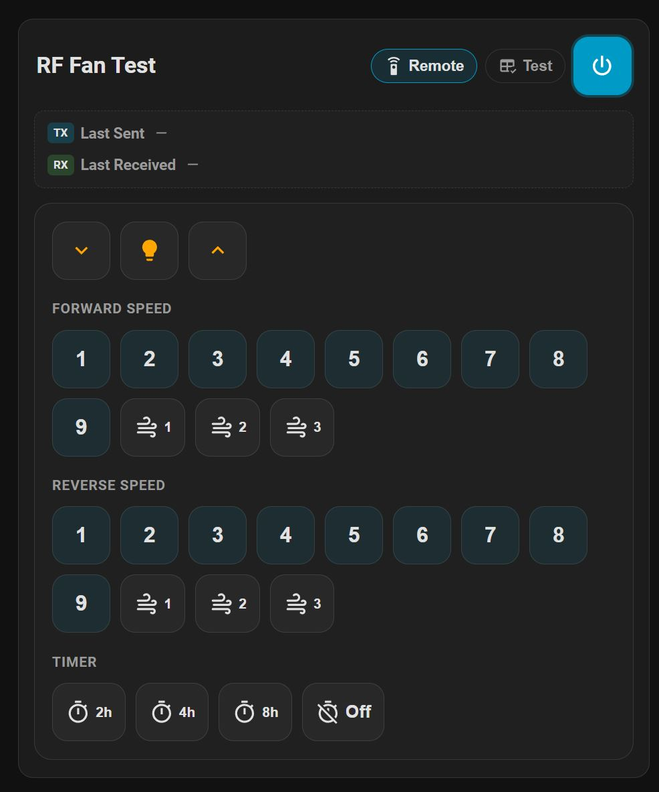
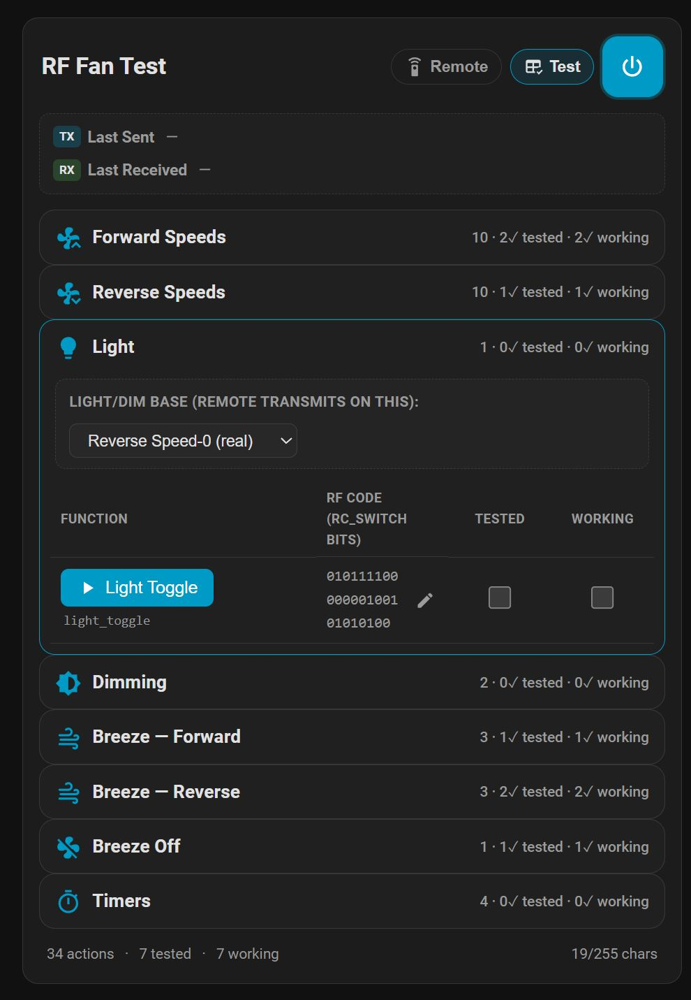

[](https://my.home-assistant.io/redirect/hacs_repository/?owner=Ltek&repository=rf-fan-card&category=dashboard)

# RF Fan Card

A Home Assistant custom **Dashboard** card for controlling and bench-testing a 433 MHz RF fan.
Repo: **[Ltek/rf-fan-card](https://github.com/Ltek/rf-fan-card)**.

Designed to work with the **[`ha-rf-fan`](https://github.com/dasimon135/ha-rf-fan)** integration by
dasimon135 — it uses that integration's ESPHome gateway (the `..._transmit_rf_fan` action) to send
codes **straight to the ESPHome node, bypassing the integration's Python layer entirely**.

**Highlights**
- A physical-remote-style **Remote** UI *and* a per-code **Test** table — enable either or both.
- Ships with a **full built-in code map** — set your gateway service and go, no config needed.
- **Light/Dim without changing fan speed** (see [Light/Dim behavior](#notes)).
- **Tested / Working** tracking per code, persisted to a helper.
- Optional **live capture readout** of the last sent/received code.
- Per-button and per-section show/hide, editable codes, and more — all from the visual editor.

**Requirements:** Home Assistant with an ESPHome node exposing an `..._transmit_rf_fan` action
(as set up by the `ha-rf-fan` integration / its gateway YAML). The card only *transmits*.

## Layout

The card has **two UI regions**. When both are enabled, header chips show/hide each live; when only
one is enabled the chips are hidden (unnecessary).

- **Remote** — a physical-remote-style control surface:
  - **Light** row: Dim Down (⌄) — Light on/off (bulb) — Dim Up (⌃).
  - **Separate Forward and Reverse** speed sets (each direction is its own code), plus **Breeze**
    (Off + Forward 1–3 + Reverse 1–3) and **Timer** buttons.
  - Power is either a per-direction Off button in each speed set, or — with `single_power` — a
    single on/off button in the **top-right corner**.
  - The **last-pressed** button stays highlighted so you can see the assumed state. Speed and breeze
    share one highlight (mutually-exclusive running states, so only one is ever lit); timer is
    tracked separately (it coexists with a running speed). The highlight is stored in the browser
    (`localStorage`, per gateway) — it only reflects presses made from this card and won't track the
    physical remote.
  - Buttons with no configured code are hidden automatically; you can also hide any button, fold
    breeze into the speed rows, and show/hide each section header from the editor.
- **Test** — the per-code table below.

Config controls which regions are enabled (`show_remote`, `show_test`) and which shows on load
(`default_view: remote | test | both`).

The **Test** region groups codes into collapsible **sections** (Forward Speeds, Reverse Speeds,
Light, Dimming, Breeze Forward/Reverse, Breeze Off, Timers). Each row:

```
(1) ▶ Speed 1        01011110000000100001010000  ✎        [☑ Tested]  [☑ Working]
```

- **Function (left):** a Trigger button labelled with the action name (speeds are numbered).
  Pressing it **transmits the raw RF frame directly through the ESPHome gateway** —
  `esphome.<gateway>_transmit_rf_fan` with `{ action, code, repeat_count }`. **This bypasses the
  `rf_fan` Python integration entirely** (no assumed-state tracking, no entities). It works for
  every code, including ones with no HA entity.
- **RF code (middle):** the exact bare rc_switch bit string (or `raw:` timings) being sent. A ✎
  button lets you **edit the code** — you're asked to confirm, then the new code is saved into the
  card's `codes` override (persists in the dashboard config).
- **Tested / Working (right):** two checkboxes per row. **These don't map to anything on the fan**
  — pure bookkeeping so you know which codes you've tested and which work. Persisted to an
  `input_text` helper.

## Bypassing the integration

There are three layers: the **`rf_fan` integration** (Python + entities), **ESPHome** (the radio
gateway), and the **fan**. This card skips the integration and calls the ESPHome service directly —
so `rf_fan` never runs. ESPHome can't be skipped (HA has no radio). If you'd rather not depend on
the integration's service at all, expose your own ESPHome API service (`rc_switch` transmit or
`remote_transmitter` raw) and point the card's **gateway service** at that name.

## Codes are built-in

This card **ships with the full v3 code map baked in** (34 codes, bare rc_switch bit strings). Just
set your gateway service and go — no pasting needed. To override, paste a JSON/YAML `codes` object
into the editor (or see [`rf-fan-card.example.yaml`](rf-fan-card.example.yaml) for the full map and a `raw:`
timing fallback per row). Overriding replaces the built-in map entirely. Editing a single code with
the ✎ button snapshots the full map into your config first, so the others aren't lost.

## Install

### Via HACS (recommended)

[](https://my.home-assistant.io/redirect/hacs_repository/?owner=Ltek&repository=rf-fan-card&category=dashboard)

1. Click the badge above (adds this repo to HACS), or in HACS → **⋮ → Custom repositories** add `https://github.com/Ltek/rf-fan-card` as type **Dashboard**.
2. Install **RF Fan Card**. HACS adds the Dashboard resource for you.
3. Clear your browser cache and hard-refresh.
4. Add the card to a dashboard: type **RF Fan Card** in the card picker, or use the YAML below.

### Manual

1. Copy `rf-fan-card.js` to `/config/www/rf-fan-card.js`.
2. Add it as a Dashboard resource (Settings → Dashboards → ⋮ → Resources):
   - URL: `/local/rf-fan-card.js`
   - Type: **JavaScript Module**
3. Add the card to a dashboard: type **RF Fan Card** in the card picker, or use the YAML below.

## Set up the Tested/Working helper

The checkboxes are saved as a compact bit-packed string into an `input_text` helper.

1. Settings → Devices & Services → **Helpers** → Create Helper → **Text**.
2. Give it a name (e.g. `RF Fan Test Results`). The default 255-char max is plenty — the flags are
   bit-packed (2 bits per code → base64), so all 34 codes store in ~19 chars.
3. Select the helper in the card editor's **Tested / Working storage** section.

If no helper is set, the checkboxes still toggle but won't persist across reloads.

## Find your gateway service

The card needs the ESPHome node's service prefix. In **Developer Tools → Actions**, search for a
service ending in `_transmit_rf_fan` (e.g. `esphome.rf_fan_gateway_transmit_rf_fan`). Enter the part
**before** `_transmit_rf_fan` (here: `rf_fan_gateway`) in the editor's **ESPHome gateway service**
field.

## Minimal YAML (uses built-in codes)

```yaml
type: custom:rf-fan-card
title: RF Fan Test
gateway_service: rf_fan_gateway
state_helper: input_text.rf_fan_test_results
```

Remote-only, single power button, breeze folded into the speed rows:

```yaml
type: custom:rf-fan-card
title: Bedroom Fan
gateway_service: rf_fan_gateway
show_test: false          # remote only → view chips hidden automatically
single_power: true
single_power_dir: fwd
breeze_with_speed: true
headers:
  forward: false          # hide the "Forward Speed" header too
```

For the full explicit code map (and a `raw:` fallback per row), see
[`rf-fan-card.example.yaml`](rf-fan-card.example.yaml).

## Options

| Option | Type | Default | Notes |
|---|---|---|---|
| `title` | string | — | Card header. |
| `gateway_service` | string | — | ESPHome service prefix; card calls `esphome.<prefix>_transmit_rf_fan`. |
| `codes` | map | *built-in* | `{ action: code }`. Leave blank to use the baked-in v3 map. |
| `labels` | map | `{}` | Optional `{ action: friendly label }` merged over built-in labels. |
| `repeat_count` | int | `4` | RF repeats per transmit (1–10). These receivers usually need the frame repeated. |
| `state_helper` | string | — | `input_text.*` entity storing Tested/Working (bit-packed). |
| `confirm_send` | bool | `false` | Ask before transmitting. |
| `show_remote` | bool | `true` | Enable the Remote UI region. |
| `show_test` | bool | `true` | Enable the Test table region. |
| `default_view` | string | `remote` | Which region shows on load: `remote`, `test`, or `both`. |
| `hidden_buttons` | list | `[]` | Action names hidden from the remote (set via the editor's Remote Buttons panel). |
| `breeze_with_speed` | bool | `false` | On: each direction's breeze buttons sit in that direction's speed row. Off: separate Breeze section. |
| `light_base` | string | `fake_1111` | Base Light/Dim ride on so they don't change speed. Default `fake_1111` puts an unused value in the speed field — this fan reads the light/dim bit and ignores the unknown speed, so light toggles without moving the blades. Others: `fake_1010`/`fake_1110`, `fwd0`/`rev0` (real Speed-0, **stops the fan**), `last_speed`, `literal`. Also selectable live from the Test UI's Light section. |
| `show_capture` | bool | `false` | Show a live readout — `TX Last Sent (#n)  <code> - match: Name` and an `RX Last Received` line (RX via `esphome.rf_fan_received`). |
| `capture` | map | *all on* | Per-element visibility of the readout: `tx`, `rx`, `count`, `match` (each bool). |
| `single_power` | bool | `false` | On: one on/off button in the remote's top-right (replaces per-direction Off buttons). |
| `single_power_dir` | string | `fwd` | Which off code the single power button sends: `fwd` (speed_0) or `rev` (reverse_0). |
| `headers` | map | light off, rest on | Per-section header visibility: `light` (default hidden), `forward`, `reverse`, `breeze`, `timer` (default shown). |
| `sections_open` | bool | `false` | Test-table sections expanded by default (collapsed when false). |
| `min_refresh_seconds` | int | `0` | Throttle for live re-sync of the helper state. |

## Notes

- **This card only transmits.** The fan has no receiver feedback (assumed state), so a successful
  send just means the frame went on the air — use the physical fan to judge *Working*.
- **Bare bit strings.** The ESPHome gateway's `transmit_rf_fan` action feeds `code` straight into
  `remote_transmitter.transmit_rc_switch_raw` (protocol hardcoded in the node YAML), so codes are
  **bare 26-bit rc_switch strings** — no `6:`/`<proto>:` prefix. (Reference docs call them
  "protocol 6", but that number is not part of the transmitted string.) If you paste codes that
  still carry a numeric prefix, the card strips it at transmit time; `raw:…` timings are left as-is.
- **Light/Dim are speed modifiers, not independent codes.** The last 6 bits carry direction + the
  command (light = bit 23, dim up = bit 24, dim down = bits 24+25); the first 20 select the speed.
  The physical remote keeps the current speed in every light/dim frame so it doesn't change speed.
  The card rebuilds the Light/Dim frame on the base chosen by **`light_base`** so it won't change a
  running fan. The default **`fake_1111`** puts an *unused* value in the speed field — this fan
  honors the light/dim bit and ignores the unknown speed, so the light toggles without touching the
  blades. (Real Speed-0 bases — `fwd0`/`rev0` — *do* stop the fan, so they're not the default.)
- Reverse speeds are the forward frame with the last 6 bits `010000` → `100000`; Breeze Off is a
  dedicated code (not derived).
- Tested/Working are stored keyed by action name and guarded by a hash of the code set — if you
  change the `codes` map, old flags are safely ignored rather than mislabeled.
---

## Screenshots

<!-- SCREENSHOTS:START -->
<table>
  <tr>
    <td align="center" valign="top">
      
    </td>
    <td align="center" valign="top">
      
    </td>
    <td></td>
    <td></td>
  </tr>
</table>
<!-- SCREENSHOTS:END -->
